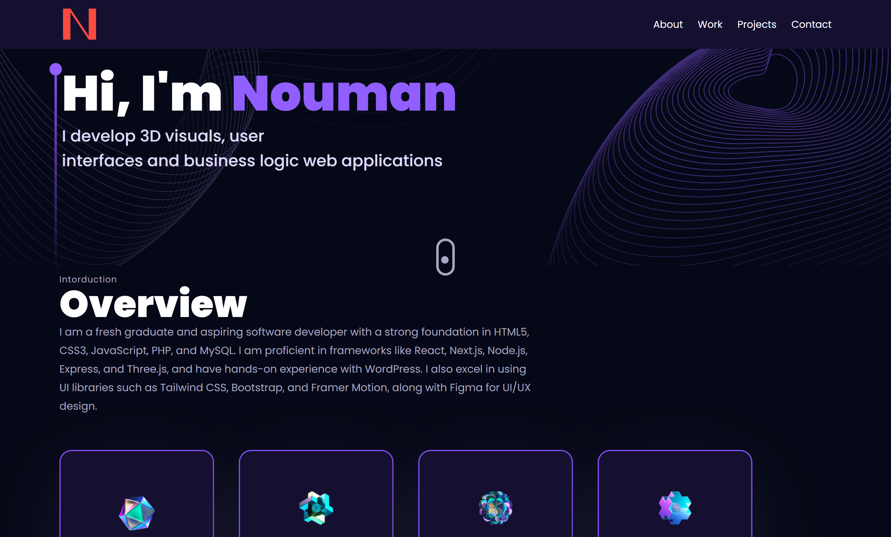

# Rhombix Technologies Internship Tasks

Welcome to my GitHub repository for the Rhombix Technologies Internship Program! This repository contains all the tasks and projects I have completed during my internship.

## About Me

I am an intern at Rhombix Technologies, gaining hands-on experience in web development and other cutting-edge technologies. This repository showcases my progress and the tasks I have accomplished.

## Tasks

### Task 1: Personal Portfolio

**Description**:  
Create a personal portfolio showcasing your skills, projects, and experience.

**Technologies Used**:  
- React
- Tailwind CSS
- Framer Motion

**Live Link**:  
[View Live Portfolio](https://noumanali.vercel.app/)  
*(Right-click and open in a new tab)*

**Screenshot**:  

**Overview**:  
Hi, I'm Nouman! This portfolio is a development project that highlights my work and expertise. It includes an overview of my skills, projects, and contact information.

### Task 2:  (Upcoming)

**Description**:  

**Technologies Planned**:  
- 

---
Thank you for visiting my repository! I look forward to completing more tasks and growing my skills during this internship.
